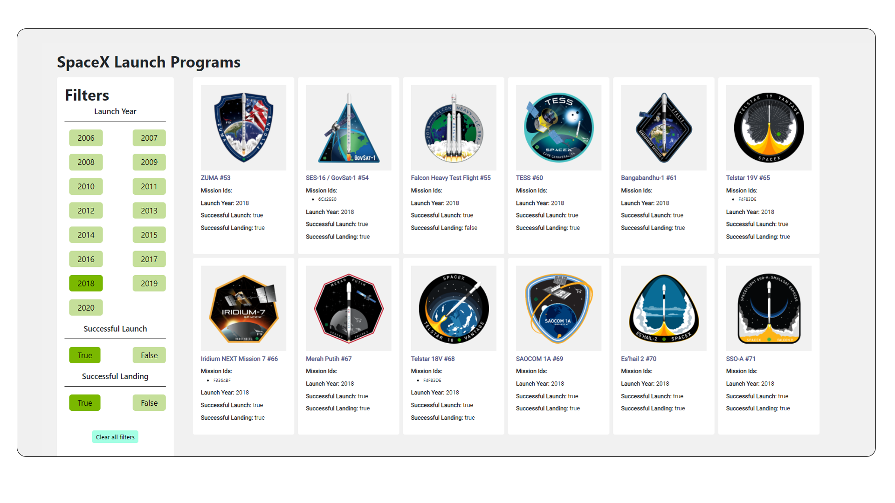

<details open="open">
  <summary>Table of Contents</summary>
  <ol>
    <li>
      <a href="#description">Description</a>
      <ul>
        <li><a href="#built-with">Built With</a></li>
      </ul>
    </li>
    <li>
      <a href="#getting-started">Getting Started</a>
      <ul>
        <li><a href="#prerequisites">Prerequisites</a></li>
        <li><a href="#installation">Installation</a></li>
      </ul>
    </li>
    <li><a href="#contact">Contact</a></li>
  </ol>
</details>

# You can check the site at:
[Kudosware Project](https://kudosware-project.netlify.app)

# Project Title
<br/>
<p align="center">
  <a href="https://github.com/othneildrew/Best-README-Template">
    
  </a>
</p>
<br/>
SpaceX Launch Program

## Description

The site manages to fetch the number of launches by SpaceX Launch Program and uses given filters to fiter out between
* Launch Years
* Successful Launches
* Successful Landings

The site can do all the three filters together or each one individividually or two together. The code for filtering was written with both:
* If- Else-if Ladder
* Ternary Operator

The site does a GET request using [axios](https://www.npmjs.com/package/axios) and fetches data. The fetched data is then passed as props to individual components and the components are rendered.

The application does not use a basic CSS styling. The elements were styled with [SASS / SCSS](https://www.npmjs.com/package/node-sass)

## Built With
* [ReactJS](https://reactjs.org/)
* [Netlify](https://www.netlify.com/)


## Getting Started

First Clone the repository. Install npm modules and start the application

### Prerequisites:
* Node

### Instalation
* Clone the repository
   ```sh
   git clone https://github.com/RexTitanium/Kudos-project.git
   ```
* Install npm packages
  ```sh
  npm install
  ```
* Initialize the site
  ```sh
  npm start
  ```

## Contact
* Email : s4samyak@gmail.com
